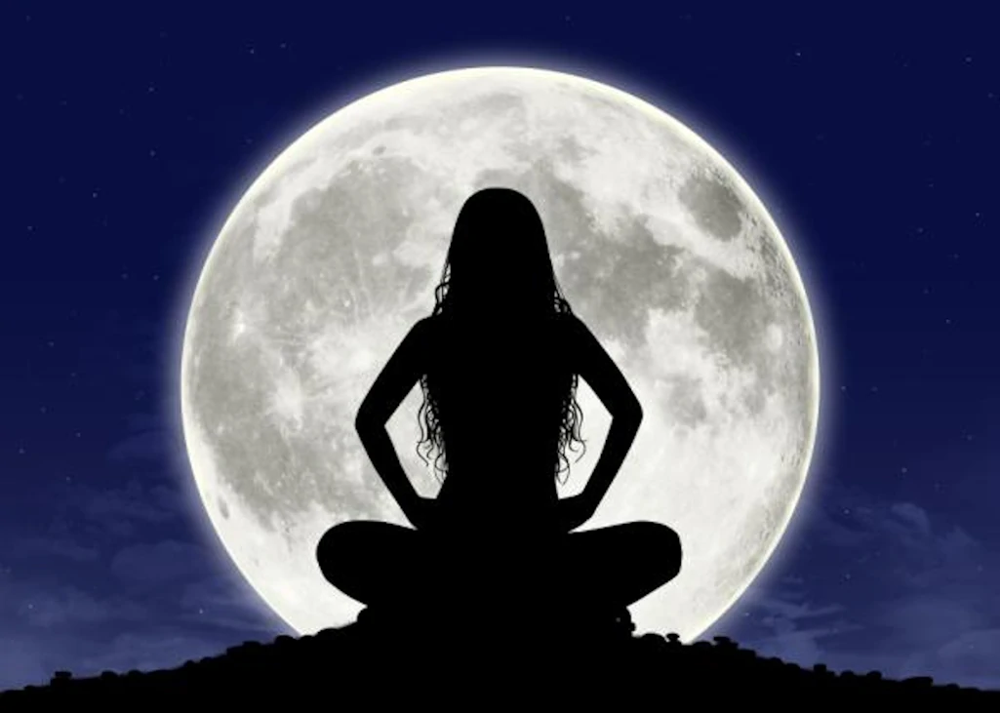
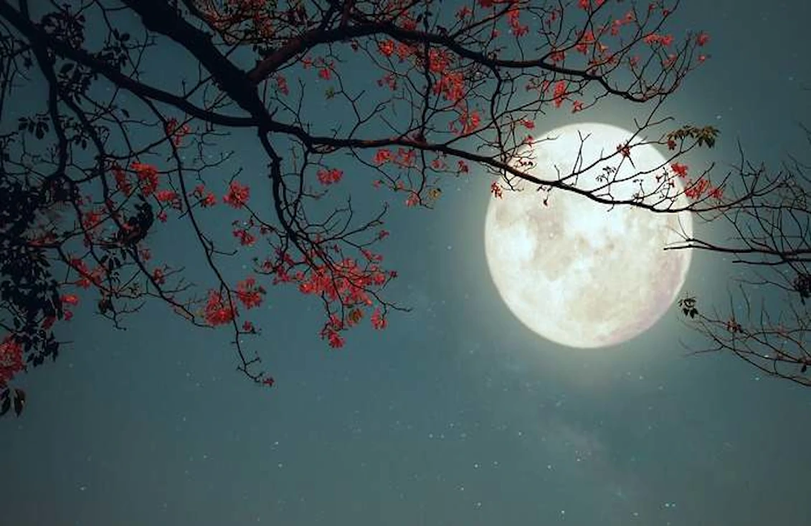

<h1 style="text-align:center;">Madre Tierra</h1>

<h4>
1.Luna nueva: La luna no es visible desde la Tierra porque está entre la Tierra y el Sol. 

2.Cuarto creciente: La parte iluminada de la luna va aumentando, formando una media luna visible por la tarde y noche. 

3.Luna llena: La cara de la luna está completamente iluminada, visible durante toda la noche. 

4.Cuarto menguante: La parte iluminada de la luna disminuye, formando una media luna visible por la noche y la madrugada. 

</h4>

https://youtu.be/84Tq-eAJIk4?list=RD84Tq-eAJIk4

       

<https://www.pinkfloyd.com/home>

[Luna](https://www.pinkfloyd.com/home)
